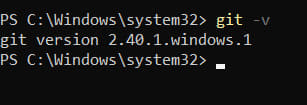
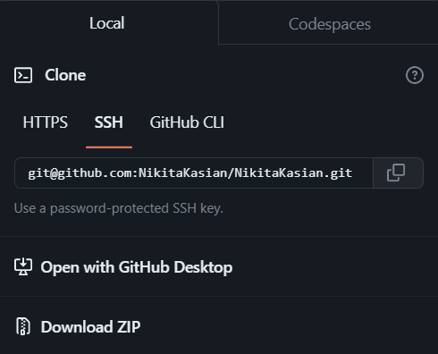
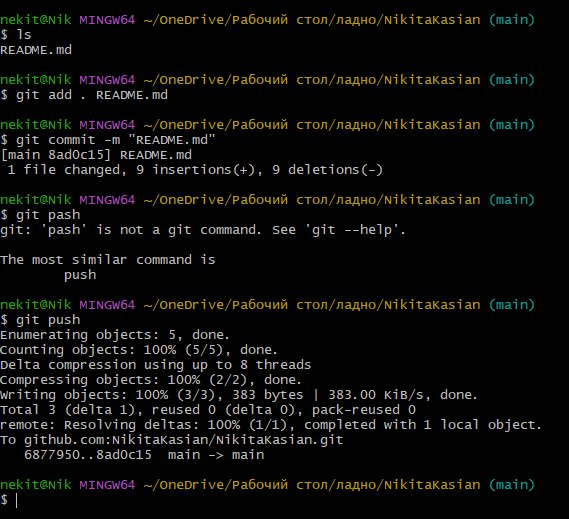




Виконали: студенти 4 курсу групи № 546
Касьян М.Г.		


**Мета роботи:** зарееструватися на Github та навчитися користуватися базовими командами у Git Bash

**Виконання завдання:**

1. Спочатку створюємо аккаунт на Github:


Рисунок 1.1

1. Далі встановлюємо CHOCOLATEY за допомогою Powershell:

Для цього використовуємо у powershell команду: 
```
Set-ExecutionPolicy Bypass -Scope Process -Force; [System.Net.ServicePointManager]::SecurityProtocol = [System.Net.ServicePointManager]::SecurityProtocol -bor 3072; iex ((New-Object System.Net.WebClient).DownloadString('https://chocolatey.org/install.ps1'))
```


1. Встановлюємо гіт та перевіряємо.




Рисунок 1.2 – Версія GitHub

1. Налаштовуємо гіт у Git Bash вказавши ім'я та адресу електронної пошти. Для цього використаємо команди:
```
git config --global user.name "Kasian 546"

git config --global user.email m.g.kasian@student.khai.edu

```

1. Згенеруємо новий SSH ключ, використаємо команду:
```
ssh-keygen -t ed25519 -C " <m.g.kasian@student.khai.edu> "
```


В результаті отримали файл с публічним та приватним ключем.

1. Додамо ключ до облікового запису Github:


Рисунок 1.3– ключ до облікового запису

1. Створимо новий репозиторій та налаштовуємо опис:


Рисунок 1.4 


Рисунок 1.5– Новий  репозиторій

1. Завантажимо репозиторій на компьютер за допомогою ssh, використаємо команду:



Рисунок 1.6 - ssh ключ
```
git clone [git@github.com:NikitaKasian/NikitaKasian.git](mailto:git@github.com:Alexandr-546/Alexandr-546.git "mailto:git@github.com:Alexandr-546/Alexandr-546.git")
```


Рисунок 1.7 – Файл на ПК

1. Відредагуємо Readme.md файл та відправимо його на github: Команди на рисунку 1.8, результат на рисунку 1.9:




Рисунок 1.8


Рисунок 1.9 – Результат зміни 

`	`Тобто, спочатку переходимо у нашу папку, питаємо Git що в цій папці, далі вказуємо Git-у слідкувати за файлом, робимо нову версію нашого файлу та завантажуємо змінений файл у GitHub. 


Висновки

`	`В даній лабораторній роботі було базове ознайомлення з функціоналом, налаштуваннями та командами GitHub.

`	`Було створено свій GitHub аккаунт, згенерували SSH ключ, створили репозиторій, завантажили на ПК та внесли зміни, потім зробивши нову версію завантажили на свій GitHub аккаунт. Ознайомилися та вивчили базові команди, що в подальшому будуть використовуватися. 

