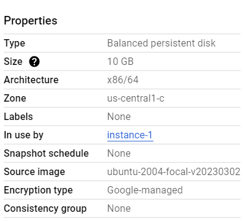
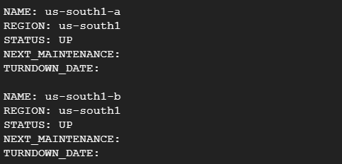




Виконали: студенти 4 курсу групи № 546

напряму підготовки (спеціальності)

172 «Телекомунікації та радіотехніка»	

Касьян М.Г.   		


**Мета роботи:** зарееструватися в Google Cloud та створити віртуальну машину за допомогою вбудованих графічних налаштувань та за допомогою CLI.

**Виконання роботи:**

1. Перше що зробимо, це зареєструємося на Google Cloud та налаштуємо персональні данні тощо, рисунок 1.1:


Рисунок 1.1 – Аккаунт 

1. Далі створюємо проект. 

Заходимо до меню проектів, обираємо варіант та переходимо до налаштування. Обираємо назву проекту, ідентифікатор, організацію.  Це також можна подивитися на рисунку 1.1. 

1. Створюємо віртуальну машину за допомогою вбудованих графічних налаштувань. У процесі налаштування дуже багато характеристик, але було обрано саме основне і в результаті отримали такі властивості:



Рисунок 1.2 – Характеристики віртуальної машини 

В залежності від регіону, де ми створюємо віртуальну машину, буде певна ціна за використання і в нашому випадку було налаштовано до 13 доларів щомісячно.

1. Далі створюємо віртуальну машину за допомогою CLI.  

Для цього викликаємо 

```
Activate Cloud Shell
``` 

та запишемо команду 

```
gcloud compute
```

, два рази Tabulator, результат на рисунку 1.3:


Рисунок 1.3 

Подивимось, які зони існують за допомогою команди

```
 gcloud compute zones list
```

, результат на рисунку 1.4: 



Рисунок 1.4 – Зони 

Цей список дуже довгий, але було обрано наступна зона:

```
NAME: ubuntu-minimal-2210-kinetic-amd64-v20230502

PROJECT: ubuntu-os-cloud

FAMILY: ubuntu-minimal-2210-amd64

DEPRECATED: 

STATUS: READY
```
 

На основі даних вказаних вище записується ключ, який запускає створення нашої віртуальної машини. В результаті отримано дві віртуальні машини, які були створені двома способами, рисунок 1.5 – 1.6: 


Рисунок 1.5


Рисунок 1.6 

Висновок

В даній лабораторній роботі була зроблена реєстрація в Google Cloud та створення віртуальної машини (ВМ) за допомогою вбудованих графічних налаштувань та за допомогою Command Line Interface (CLI).

У першому випадку створення ВМ створюється людиною через список можливих характеристик. Він достатньо зручний, наглядний і робиться все на інтуїтивному рівні.  

В другому випадку ВМ створювалась через командний рядок, що також не виявив труднощів. Цей варіант не має труднощів, якщо знати, яку саме команду викликати, тобто якщо людина не працювала або не знає як правильно налаштувати ВМ через  CLI, їй буде набагато легше це зробити першим варіантом, а ось програміст скоріш за все буде використовувати саме другий варіант. 
