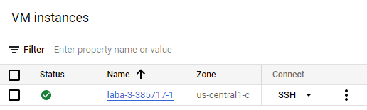

Лабораторна робота №3
Середа О.В. 546група

1. **Встановлюємо Terraform** 

Для цього відкриваємо PowerShell та пишемо команду **choco install terraform,** після чого вводимо команду **terraform version,** для перевірки чи все добре встановилося та подивимось яка версія, результат на рисунку нижче:


Далі створюємо новий проект GCP:


Після чого, переходимо до створення **service account**. Для цього тиснемо на вкладку **create service account** і переходимо в налаштування де задаються назва, ID та ролі:


 

Далі треба активувати ключ, тож перейдемо через три крапочки у вкладку Manage keys та створимо ключ, після чого зберігаємо у себе на ПК: 


Наступним кроком переходимо до налаштування **Terraform.** Створюємо три файли типу **(main, variables, outputs).tf** в яких буде записан певний код. У **main** вказується **Terraform,** що працюватиме із GCP, створюється  **network** та **subnetwork**, у **vm\_instance** задаємо 5 тегів з будь яким ім’ям(без великих літер на пробілів, бо буде викликати похибку), та конфігуруємо **firewall(брандмауэр).** В **variables** вказуємо Project ID:назву та назву файлу з ключем. 

**main.tf:**
```
terraform {

`  `required\_providers {

`    `google = {

`      `source = "hashicorp/google"

`      `version = "4.51.0"

`    `}

`  `}

}

provider "google" {

`  `credentials = file(var.credentials\_file)

`  `project = var.project

`  `region  = var.region

`  `zone    = var.zone

}

resource "google\_compute\_network" "vpc\_network" {

`  `name = "servis"

}

resource "google\_compute\_subnetwork" "Labsubnet" {

`  `name          = var.subnet\_name

`  `network       = google\_compute\_network.vpc\_network.self\_link

`  `ip\_cidr\_range = "10.2.0.0/16"

`  `region        = var.region

}

resource "google\_compute\_instance" "vm\_instance" {

`  `name         = var.machine\_name

`  `machine\_type = "f1-micro"

`  `tags = ["may", "march", "day", "girl", "man"]

`  `boot\_disk {

`    `initialize\_params {

`      `image = "debian-cloud/debian-11"

`    `}

`  `}

`  `network\_interface {

`    `network = google\_compute\_network.vpc\_network.name

`    `access\_config {

`    `}

`  `}

}

resource "google\_compute\_firewall" "vpc-network-allow" {

`  `name    = "letmein"

`  `network = google\_compute\_network.vpc\_network.self\_link

`  `allow {

`    `protocol = "tcp"

`    `ports    = ["80", "8080", "1000-2000"]

`  `}

`  `target\_tags = ["http-server","https-server"]

`  `source\_tags = ["vpc-network-allow"]

}

**variables.tf:**

variable "project" {

`    `default = " laba-3-385717"

}

variable "credentials\_file" {

`    `default = "laba-3-385717-2760e1e75b3a.json"

}

variable "region" {

`    `default = "us-central1"

}

variable "zone" {

`    `default = "us-central1-c"

}

variable "machine\_name" {

`    `default = " laba-3-385717-1"

}

variable "subnet\_name" {

`  `default = "laba-3-385717-subnet-1"

}

**outputs.tf:**

output "ip\_intra" {

`  `value = google\_compute\_instance.vm\_instance.network\_interface.0.network\_ip

}

output "ip\_extra" {

`  `value = google\_compute\_instance.vm\_instance.network\_interface.0.access\_config.0.nat\_ip
```
}

Після того, як підготували ці три файли, повертаємось у PowerShell та прописуємо наступну команду **terraform init**, тобто ініціалізуємо проект, після чого дописуємо ще одну команду **terraform apply**, щоб отримати список наступних дій **Terraform.**


Як можна побачити з рисунків вище, всі операції успішні та не виявлено похибок. В самому кінці, віртуальна машина сформувала дві ір-адреси, а саме внутрішня адреса VPC мережа та адреса NAT за допомогою якої можна  під’єднатися до ВМ. Спробуємо замінити теги та подивимось, як на це відреагує **terraform:**

Тепер перевіримо, що в нас змінилося в Google Cloud, а саме в нашому проекті: 




Добре видно, що ВМ була створена правильно, з коректними адресами, тегами тощо. 

Подивимось, що зміниться при видаленні ВМ, та запишемо наступну команду **terraform destroy:**


Тобто, якщо подивимось уважно, **terraform** все видалив, тобто відпрацював коректно.
